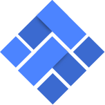

## Arweave4s

### Overview

Arweave4s is a lightweight modular http client for the Arweave blockchain (https://github.com/ArweaveTeam/arweave/)

### Scaladoc

### Contact

By questions, comments or suggestions feel free to get in touch by creating an PR or an issue.

### Caveats

Copyright 2018 Ivan Morozov, Gustav Behm, Tokn GmbH (https://upvest.co)

Arrweave4s is provided to you as free software under the MIT license.
The MIT software license is attached in the [COPYING](COPYING) file.